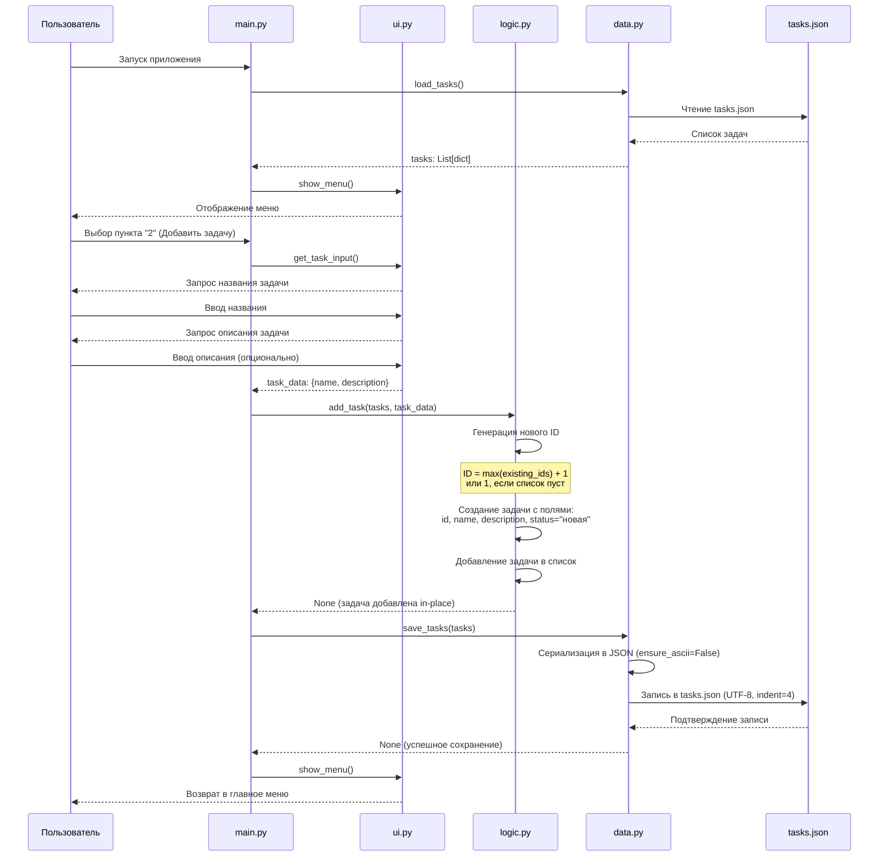

# Диаграмма последовательности: Добавление задачи



## Описание взаимодействий

### Шаг 1: Запуск приложения
Модуль `main.py` загружает существующие задачи из файла через `load_tasks()` из модуля `data.py`.

### Шаг 2: Отображение меню
Модуль `main.py` вызывает `show_menu()` из модуля `ui.py` для отображения главного меню.

### Шаг 3: Выбор операции
Пользователь выбирает пункт меню "2" (Добавить задачу).

### Шаг 4: Ввод данных задачи
Модуль `main.py` вызывает `get_task_input()` из модуля `ui.py`, которая запрашивает у пользователя:
- Название задачи (обязательное поле)
- Описание задачи (опциональное поле)

Функция возвращает словарь `task_data` с ключами `name` и `description`.

### Шаг 5: Добавление задачи в логику
Модуль `main.py` передает список задач и данные новой задачи в функцию `add_task()` модуля `logic.py`.

Модуль `logic.py`:
- Генерирует уникальный ID (максимальный существующий ID + 1, или 1 если список пуст)
- Создает новую задачу со структурой:
  ```python
  {
      "id": <новый_id>,
      "name": <название>,
      "description": <описание>,
      "status": "новая"
  }
  ```
- Добавляет задачу в список
- Возвращает обновленный список задач

### Шаг 6: Сохранение задач
Модуль `main.py` вызывает `save_tasks(tasks)` из модуля `data.py` для сохранения обновленного списка.

Модуль `data.py`:
- Сериализует список задач в JSON-формат с отступами (indent=4)
- Использует UTF-8 кодировку и ensure_ascii=False для корректного отображения кириллицы
- Записывает данные в файл `tasks.json`
- Если файл не существует - создает его

### Шаг 7: Возврат в меню
Модуль `main.py` возвращает пользователя в главное меню через `show_menu()`.

## Альтернативные потоки

### Ошибка при чтении файла
Если при чтении `tasks.json` возникает ошибка (например, файл поврежден), модуль `data.py` должен обработать исключение и вернуть пустой список или вывести сообщение об ошибке.

### Ошибка при записи файла
Если при записи в `tasks.json` возникает ошибка (например, нет прав доступа), модуль `data.py` логирует ошибку и обрабатывает исключение. Ошибка может быть обработана в `main.py` с выводом сообщения пользователю.

