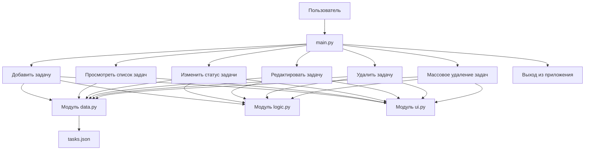

# Диаграмма Use Case для TaskManager

## Описание Use Cases

### UC-1: Добавить задачу
**Актор**: Пользователь  
**Предусловия**: Приложение запущено  
**Основной поток**:
1. Пользователь выбирает пункт меню "Добавить задачу"
2. Система запрашивает название задачи
3. Пользователь вводит название
4. Система запрашивает описание задачи
5. Пользователь вводит описание (опционально)
6. Система создает задачу с уникальным ID и статусом "новая"
7. Система сохраняет задачу в tasks.json
8. Система подтверждает успешное добавление

### UC-2: Просмотреть список задач
**Актор**: Пользователь  
**Предусловия**: Приложение запущено  
**Основной поток**:
1. Пользователь выбирает пункт меню "Просмотреть список задач" (пункт 1)
2. Система отображает список всех задач с их ID, названием, описанием и статусом
3. Если список пуст, система выводит сообщение "Список задач пуст"
4. Система возвращает в главное меню

### UC-3: Изменить статус задачи
**Актор**: Пользователь  
**Предусловия**: Приложение запущено, есть хотя бы одна задача  
**Основной поток**:
1. Пользователь выбирает пункт меню "Изменить статус" (пункт 3)
2. Система запрашивает ID задач через пробел
3. Пользователь вводит ID (например: "1")
4. Система запрашивает новый статус
5. Пользователь вводит статус ("новая", "в работе", "завершена")
6. Система обновляет статус задачи
7. Система сохраняет изменения в tasks.json
8. Система возвращает в главное меню

### UC-4: Редактировать задачу
**Актор**: Пользователь  
**Предусловия**: Приложение запущено, есть хотя бы одна задача  
**Основной поток**:
1. Пользователь выбирает пункт меню "Редактировать задачу" (пункт 4)
2. Система запрашивает ID задач через пробел
3. Пользователь вводит ID (например: "1")
4. Система запрашивает новое название задачи
5. Пользователь вводит новое название
6. Система запрашивает новое описание задачи
7. Пользователь вводит новое описание
8. Система обновляет задачу
9. Система сохраняет изменения в tasks.json
10. Система возвращает в главное меню

### UC-5: Удалить задачу
**Актор**: Пользователь  
**Предусловия**: Приложение запущено, есть хотя бы одна задача  
**Основной поток**:
1. Пользователь выбирает пункт меню "Удалить задачу" (пункт 5)
2. Система запрашивает ID задач через пробел
3. Пользователь вводит ID (например: "1")
4. Система удаляет задачу с указанным ID
5. Система сохраняет изменения в tasks.json
6. Система возвращает в главное меню

### UC-6: Массовое удаление задач
**Актор**: Пользователь  
**Предусловия**: Приложение запущено, есть задачи  
**Основной поток**:
1. Пользователь выбирает пункт меню "Массовое удаление задач" (пункт 6)
2. Система запрашивает ID задач через пробел
3. Пользователь вводит несколько ID (например: "1 2 3")
4. Система удаляет все задачи с указанными ID
5. Система сохраняет изменения в tasks.json
6. Система возвращает в главное меню

### UC-7: Выход из приложения
**Актор**: Пользователь  
**Предусловия**: Приложение запущено  
**Основной поток**:
1. Пользователь выбирает пункт меню "Выход из приложения" (пункт 7)
2. Система завершает основной цикл приложения
3. Приложение завершает работу
4. Примечание: Все изменения сохраняются автоматически после каждой операции, поэтому отдельное сохранение при выходе не требуется

